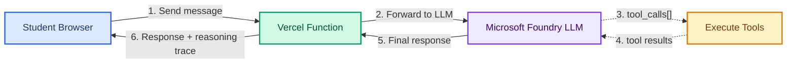

# Agent Playground

The interactive AI agent playground for my [**Agentic AI: From Acronyms to Applications**](https://segunakinyemi.com/blog/agentic-ai-from-acronyms-to-applications/) workshop.

## What Is an Agent?

There's a definition that's gained consensus in the [AI Engineering](https://www.latent.space/p/ai-engineer) community, articulated well by [Simon Willison](https://simonwillison.net/2025/Sep/18/agents/) and [Anthropic](https://www.anthropic.com/engineering/building-effective-agents):

> An LLM agent runs tools in a loop to achieve a goal.

**Tools** are functions the AI can call. **Loop** means it can call them multiple times, feeding results back in. **Goal** means there's a stopping condition. A chatbot just predicts the next word. An agent *does things*. This playground lets you see that in action.

## What Is This?

A web-based Agent Playground that lets workshop participants interact with a real AI agent powered by [Microsoft Foundry](https://learn.microsoft.com/azure/ai-foundry/what-is-foundry) on Azure. Built with the [Vercel AI SDK](https://ai-sdk.dev/) and hosted on [Vercel](https://vercel.com/), the playground visualizes the agent's **tool-calling loop** in real time, showing when the AI autonomously decides to call tools, what results it gets back, and how it synthesizes a final response.

This is the hands-on component of the workshop, embedded inside a [VS Code for Education](https://vscodeedu.com) course.

## Architecture

1. Student sends a message from the browser.
2. A Vercel serverless function forwards it to the LLM with tool definitions.
3. The LLM may request tool calls. If it does, the function executes those tools and feeds results back to the LLM.
4. The LLM produces a final text response.
5. The full reasoning trace (every step of the loop) is returned to the browser so students can watch the agent think.



## Tools

The agent has access to ten tools:

| Tool | Description |
|------|-------------|
| `get_weather` | Live weather and 3-day forecast for any city worldwide (via [Open-Meteo](https://open-meteo.com/)) |
| `get_people_in_space` | Who is currently in space right now (via [Open Notify](http://open-notify.org/)) |
| `get_recent_earthquakes` | Significant earthquakes from the past 7 days worldwide (via [USGS](https://earthquake.usgs.gov/)) |
| `get_charlotte_cinnamon_roll_rankings` | Returns my definitive cinnamon roll rankings for Charlotte, NC |
| `get_nasa_picture_of_the_day` | NASA's Astronomy Picture of the Day (via [NASA API](https://api.nasa.gov/)) |
| `get_international_space_station_location` | Current latitude/longitude of the International Space Station (via [Open Notify](http://open-notify.org/)) |
| `get_charlotte_third_places` | Third places (cafes, libraries, parks, hangout spots) in Charlotte, NC (via [Charlotte Third Places](https://charlottethirdplaces.com)) |
| `get_today_in_history` | Notable events on today's date (via [History Muffin Labs](https://history.muffinlabs.com/)) |
| `post_to_live_feed` | Posts a message to the workshop live feed at [live.segunakinyemi.com](https://live.segunakinyemi.com) |

The first 4 tools are used in Labs 1-3. All 10 are available in Lab 4 where students configure their own custom agents.

## How It Works

The playground is embedded directly in the workshop course on [VS Code for Education](https://vscodeedu.com). Each lab page includes a standalone HTML chat client that talks to the Vercel API. Students click the green play button in VS Code for Education to open the chat, and the enabled tools are configured per-lab:

- **Lab 1**: No tools (bare chatbot)
- **Lab 2**: Weather tool only
- **Lab 3**: All 4 tools (full agent)
- **Lab 4**: All 10 tools + custom instructions + recipe cards. Students configure their own agent.

The API also accepts an optional `customInstructions` field that lets students define their agent's personality.

## Environment Variables (Vercel)

| Variable | Description |
|----------|-------------|
| `FOUNDRY_API_KEY` | Microsoft Foundry API key |
| `WORKSHOP_KEY` | Auth token shared with students during the session. Required when accessing from non-trusted origins. |
| `WORKSHOP_ACTIVE` | Set to `true` to allow requests. Set to `false` to shut down all access. This is the kill switch. |
| `TRUSTED_ORIGINS` | Comma-separated list of domain names that bypass the workshop key check. Uses hostname suffix matching. Leave empty to require the key from all origins. |

## Development

```bash
npm install
npm run dev
```
